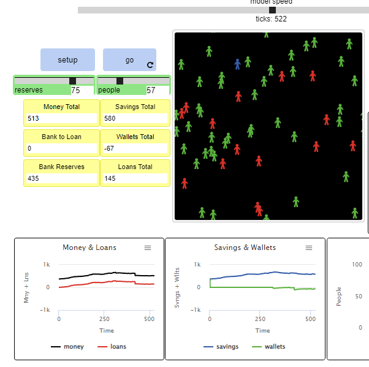

## Імітаційне моделювання комп'ютерних систем
## СПм-21-2, **Кравець Владислав Євгенович**
### Лабораторна робота №**1**. Опис імітаційних моделей та проведення обчислювальних експериментів

 

### Вибрана модель у середовищі NetLogo:
[Bank Reserves
](http://www.netlogoweb.org/launch#http://www.netlogoweb.org/assets/modelslib/Sample%20Models/Social%20Science/Economics/Unverified/Bank%20Reserves.nlogo)

 

### Вербальний опис моделі:
Ця програма моделює створення грошей в економіці через приватну банківську систему. Оскільки більша частина грошей в економіці зберігається в банках, але лише незначна їх частина потребує використання (тобто у готівковій формі) у будь-який момент часу, банкам потрібно зберігати лише невелику частину своїх заощаджень для цих операцій. Ця частина загальних заощаджень відома як банківські резерви.

Тоді банки можуть позичити решту своїх заощаджень. Уряд (у цьому випадку користувач) встановлює коефіцієнт резервування, який визначає, скільки банківських активів має зберігатися в резерві в певний час. Один «супербанк» використовується в цій моделі для представлення всіх банків в економіці. Як демонструє ця модель, коефіцієнт резервування є ключовим фактором, що визначає, скільки грошей створюється в системі.

### Як це працює:
У кожному раунді люди (представлені зображеннями) взаємодіють один з одним, щоб імітувати повсякденну економічну діяльність. Враховуючи випадково вибране число, коли особа перебуває на тому самому патчі, що й хтось інший, вона або дасть людині два чи п’ять доларів, або взагалі не отримає грошей. Після цього люди повинні звірити баланс свого гаманця з банком. Люди покладуть позитивний баланс гаманця на заощадження або погасять негативний баланс із коштів, які вже є на заощадженнях. Якщо ощадний рахунок порожній і гаманець має негативний баланс, особа візьме позику в банку, якщо кошти доступні для позики (якщо bank-to-loan 0). Інакше людина зберігає негативний баланс до наступного раунду. Нарешті, якщо хтось має гроші на заощадженнях і гроші, позичені в банку, ця особа виплатить якомога більшу частину позики, використовуючи заощадження.

### Керуючі параметри:
Повзунок RESERVES встановлює коефіцієнт банківського резервування (відсоток грошей, який банк повинен зберігати в резерві в певний момент часу). Повзунок PEOPLE встановлює кількість людей, які будуть створені в моделі після натискання кнопки SETUP. Кнопка SETUP скидає модель: вона перерозподіляє кольори плям, створює людей PEOPLE та ініціалізує всі збережені значення.

В інтерфейсі є численні вікна відображення, які допомагають користувачеві побачити, де зосереджені гроші в економіці в певний момент часу. SAVINGS-TOTAL вказує загальну суму грошей, яка зараз зберігається в заощадженнях (і, таким чином, у банківській системі). Потім банк повинен розподілити ці гроші між трьома рахунками: LOANS-TOTAL – це сума, яку банк надав у позику, BANK-TO-LOAN – це сума, яку банк має для позики, і BANK-RESERVES – це сума, яку банк надав доручено тримати в резерві. Коли банк повинен відкликати позики (тобто після підвищення норми резервування), BANK-TO-LOAN буде показувати від’ємну суму, доки не буде виплачено достатню частину позичених грошей. WALLETS-TOTAL показує загальну суму грошей, яка зберігається в гаманцях людей. Ця цифра також може бути від’ємною, коли в банку немає грошей для позики (людина буде підтримувати від’ємний баланс гаманця, доки кредит не стане можливим). MONEY-TOTAL вказує загальну суму грошей, що зараз є в економіці (SAVINGS-TOTAL + WALLETS-TOTAL). Оскільки в цій моделі WALLETS-TOTAL зазвичай дорівнює 0 (ми припускаємо, що кожен вкладає на заощадження все, що може), MONEY-TOTAL і SAVINGS TOTAL, як правило, однакові.
Колір людини говорить нам, чи є у неї гроші в заощадженнях (зелений) чи в боргах (червоний).

 

## Обчислювальні експерименти

### 1. Змінюйте ставку RESERVES під час роботи моделі та спостерігайте, як це вплине на MONEY-TOTAL.

<table>
<thead>
<tr><th>Резерви</th><th>SAVINGS</th><th>WALLETS</th></tr>
</thead>
<tbody>
<tr><td>50</td><td>480</td><td>0</td></tr>
<tr><td>30</td><td>583</td><td>0</td></tr>
<tr><td>15</td><td>662</td><td>0</td></tr>
<tr><td>60</td><td>634</td><td>-12</td></tr>
<tr><td>75</td><td>580</td><td>-67</td></tr>
</tbody>
</table>

### 2. Спочатку встановіть RESERVES на 100 і спостерігайте за ефектом на TOTAL-MONEY. Тепер спробуйте знизити РЕЗЕРВИ.

Зниження резерву, спонукає людей зберігати кошти в гаманцях.

### 3.Спробуйте встановити резервну ставку на 0. Що станеться, якщо це зробити в реальній економіці?

Загальна сума грошей в заощадженнях почала рости.

